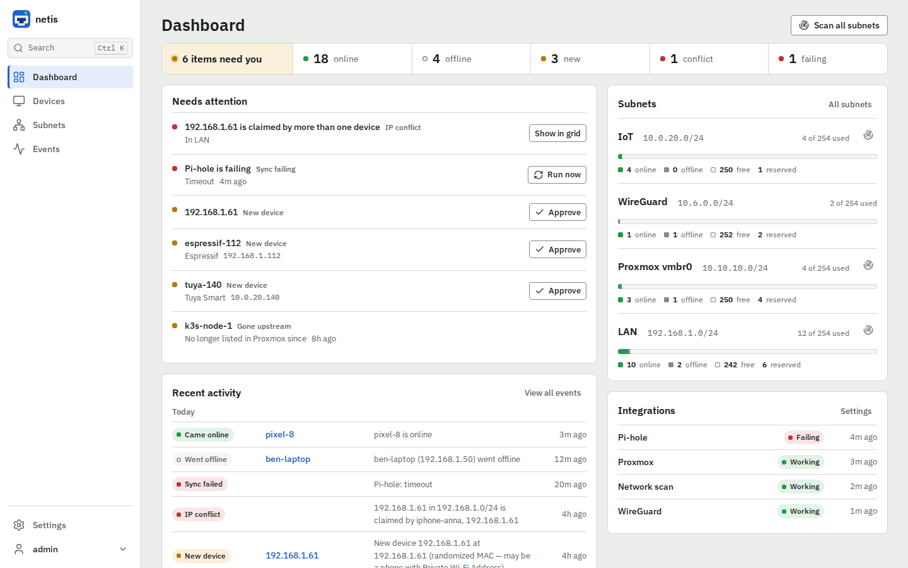
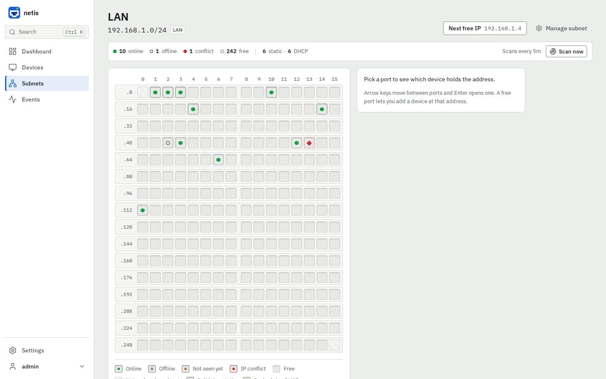
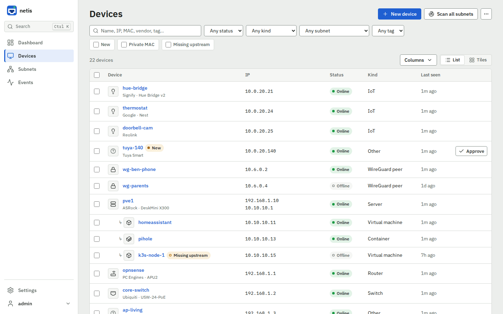
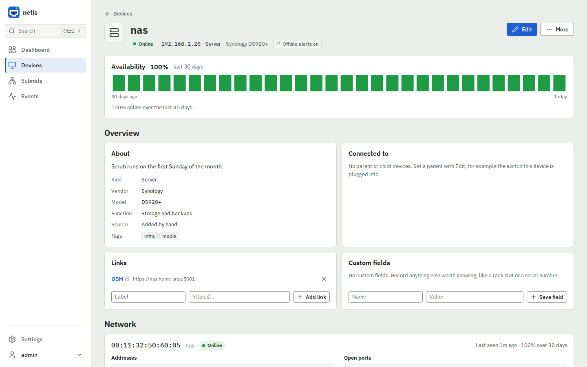
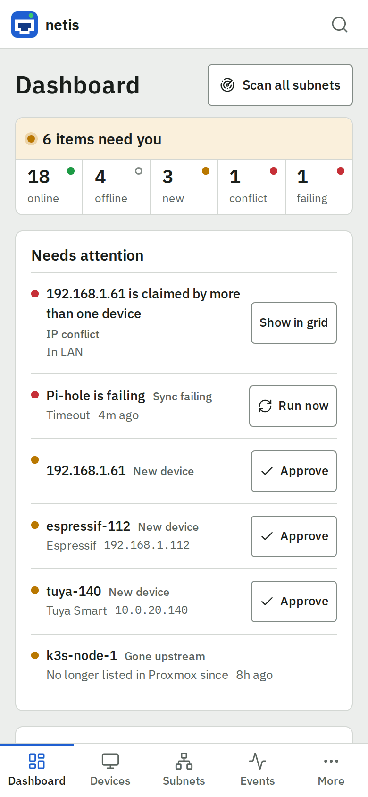

# Using netis

A tour of the pages, the navigation and keyboard shortcuts, and the theme.

[← Back to README](../README.md)

- [Dashboard](#dashboard)
- [Subnet grid](#subnet-grid)
- [Device list](#device-list)
- [Device page](#device-page)
- [Tags](#tags)
- [Events](#events)
- [Settings](#settings)
- [Navigation and shortcuts](#navigation-and-shortcuts)
- [Theme and accessibility](#theme-and-accessibility)

## Dashboard

A health strip (online, offline, new, conflicts, failing integrations, each
linking to the list behind it), a "Needs attention" list with the action for
each item (approve a new device, run a failing integration, open an IP
conflict, offline devices with alerts on, devices gone upstream), per-subnet
usage and recent activity by day. Each subnet shows its next free IP: click it
to open the subnet with that address picked, or copy it with the button beside
it.

Until setup is complete, a Finish setup panel lists what is still missing (see
[First run](install.md#first-run)).

## Subnet grid

One square per IP in a subnet: green for online, dark for used-but-offline,
yellow (marked R) for assigned but not seen yet, empty for free, red (marked !)
for an IP claimed by two devices. The border tells a static address (a
reservation) from a DHCP lease, and the subnet cards count the reservations.
Each square also names its address and state for screen readers. Squares update
live over SSE during a scan.

Hovering a square (or moving to it with the arrow keys) shows a card with the
address, its state and lease, and the device holding it with its MAC and when
it was last seen. **C** copies the address under the pointer or the focused one.

To find static addresses, the bar above the grid lists the free ranges, the
largest first; a click marks the run and opens its first address. **Free only**
fades every address that cannot be handed out, and the **Next free IP** button
has a copy button beside it. Give a subnet its DHCP pool (Settings → Network,
first and last address, or just the last octets) and the free addresses inside
it are drawn stippled and left out of the next free IP, the free ranges and the
free count, so what is offered is safe to assign statically.

## Device list

Searchable table of every known device, filtered by status, kind, subnet, tag,
new (unreviewed), private MAC or missing upstream. Filters are part of the URL
(`/devices?status=offline`, `/devices?new=1`, `/devices?subnet=2&tag=iot`), so
a filtered list can be bookmarked. MAC, lease, function and tags are optional
columns, addresses two devices share are flagged, and guests sit under their
host until you sort by a column. Admins can approve, tag or delete several
devices at once. CSV/JSON export and (for admins) a CSV import with a dry-run
preview; see [Export and CSV import](api.md#export-and-csv-import).

## Device page

Full device detail: interfaces, IPs, open ports, uptime, links, tags, custom
fields, parent/child devices (e.g. a Proxmox host and its guests), event
history, and buttons to send a Wake-on-LAN packet or run an on-demand TCP port
scan.

The magic packet goes to the directed broadcast of every subnet the device's
interface has an address in (e.g. `10.0.20.255`), so hosts on other VLANs can
be woken, and to `255.255.255.255` as before; the toast lists the addresses
used. A directed broadcast into a subnet netis is not attached to only arrives
if the router forwards it, which many do not by default.

Offline alerts are turned on per device with **More › Turn on offline alerts**
(see [Notifications](notifications.md)).

## Tags

Tags show as small coloured chips (device list, device page and the "What
netis detected" panel), each in one of seven hues that stay readable in both
themes. A tag's colour is either one you picked or, left on auto, a hue
chosen from its name, so it stays the same chip colour every time. Clicking a
tag filters the device list to it; the filter bar then shows that tag with a
button to clear it.

Editing a device's tags is a field of chips with a remove button on each one.
Type a name and press Enter, comma or Tab to add it; Backspace in an empty
box removes the last chip; pasting a comma list adds every name in it. A
suggestion list under the box narrows to existing tags as you type, with
arrow keys to move, Enter to pick and Escape to close it. Without JavaScript
the field falls back to a plain comma-separated text box.

Admins manage tags from **Settings › Tags**: a row per tag with its device
count (a link to the filtered list), a colour picker, rename and delete.
Renaming a tag to a name another tag already has merges them — every device
of the renamed tag joins the existing one, which keeps its own colour — and
the form asks you to confirm before it happens. Deleting a tag asks for
confirmation too, then removes it from every device that had it.

## Events

The full event log grouped by day, filterable by what happened, device name and
date range, paged 50 at a time. It records device-new/online/offline/ip-changed/
scan-error events, and device-missing/device-returned for integration devices
that leave or come back upstream.

## Settings

Two areas.

**Account** (everyone): your profile, changing your password (8 to 72 bytes;
changing it signs your other sessions out), the SSO link, your sessions with
per-session revoke and a sign-out-everywhere-else button, and your **API
tokens** (admins see and can revoke everyone's).

**Admin** (admins only):

- **Network** — the one place subnets are added, edited and removed, plus the
  offline threshold, presence without ping and defaults for new subnets;
- **Integrations** — one panel per integration with its status, last run, item
  count, Run now and its settings behind Configure;
- **Notifications**;
- **Tags** — colour, rename (renaming to an existing name merges the two,
  with confirmation) and delete;
- **Users** (add, delete, change role, reset a password);
- **Audit log**;
- **System** — retention, backup status and the running version, build number,
  commit, database backend and dependency versions.

An admin's page footer shows the version and links to System. Old
`/settings?tab=…` links redirect to the new pages.

## Navigation and shortcuts

Navigation is a sidebar on wide screens (folding to icons on tablets) and a
bottom tab bar on phones. **Ctrl-K** (⌘-K on a Mac), or the search button,
opens a command palette that jumps to a device by name, IP or MAC, a subnet, a
page, or an action (new device, scan all — admins only). Typing **free**
(or `free iot` for one subnet) lists every subnet's next free IP: Enter opens
it, Shift-Enter copies it.

| Key | Does |
| --- | --- |
| `/` | focuses the page's search field (or opens the palette) |
| `g d` / `g s` / `g e` / `g h` | go to devices, subnets, events and the dashboard |
| `g f` | find a free IP: each subnet's next free address |
| `n` | opens a new device (admins) |
| `?` | lists them all |

Every time is shown relative ("5m ago") with the exact time, in your time zone,
on hover.

The web app manifest lets a phone or desktop browser install netis as a
standalone app.

## Theme and accessibility

The theme follows the operating system's light/dark preference, including
when it changes, until you pick Light or Dark in the account menu (System
goes back to following the OS); that choice is remembered in the browser.

Deleting a device, subnet, user, link or custom field, and revoking sessions,
asks for confirmation first. The device search and the New/Edit device forms
also work with JavaScript turned off.
